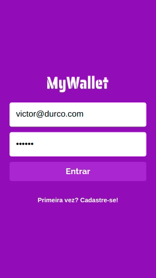

# My Wallet 💸

</br>

<p align="center">
  
</p>

</br>

## About ❔

This is the front-end repository of My Wallet, a web application that helps you control your daily expenses

<!-- ## Preview

um gif da aplicação bem maneiro -->

</br>

## Deployment 🚀

<p align="center"><a  href="https://my-wallet-pi.vercel.app/">https://my-wallet-pi.vercel.app/</a></p>

</br>

## Features ✅

-   [x] Register, login and logout into the application
-   [x] Add financial register
-   [x] Delete financial register
-   [x] Shows the total value of the user's wallet

</br>

## How to run 🏃‍♀️💨

```bash
# First clone the backend repository and follow the instructions on README file to start the server application
$ git clone <https://github.com/victordurco/api-my-wallet>


# In another folder, clone this repository
$ git clone <https://github.com/victordurco/my-wallet>

# Access the project folder cmd/terminal
$ cd my-wallet

# Install the dependencies
$ npm install

# Compile the code
$ npm run build

# Run the application
$ npm start

# The server will automatically start at localhost:3000/ on your favorite browser
```

</br>

## Tech Stack 💾

<br/>

<p align="center">


</p>

</br>

<!--
### Contributors and Contact

### Acknowledgements -->
